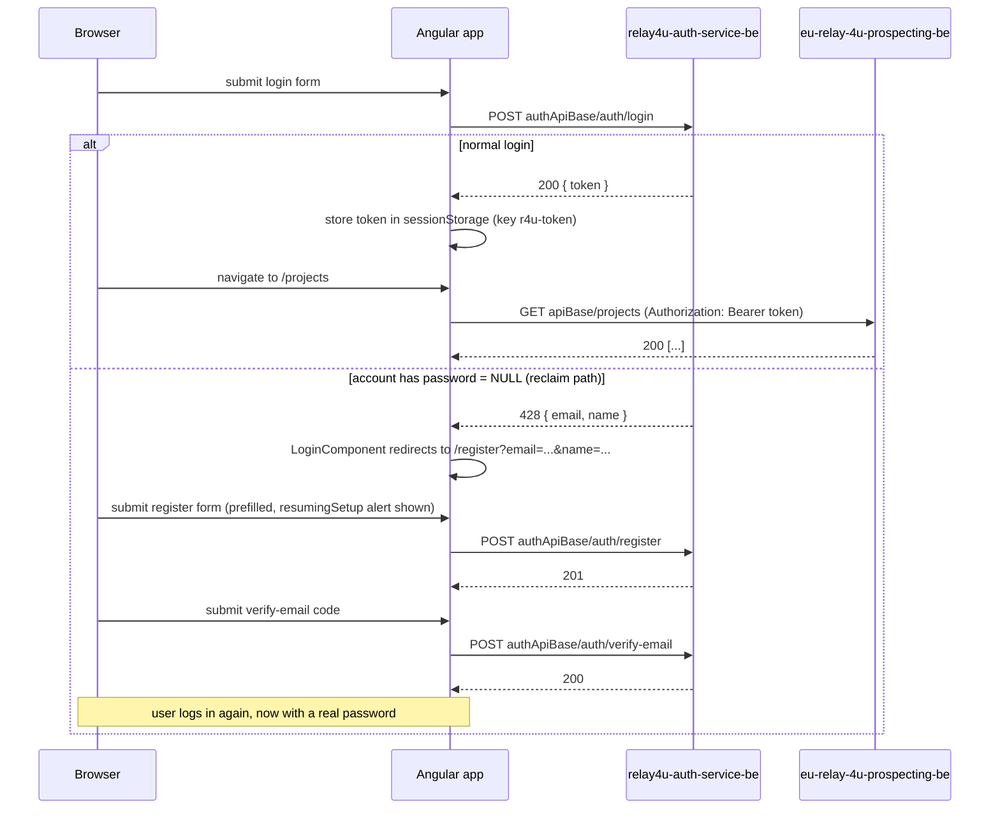

# Documentation index — eu-relay4u-prospecting-fe

Detailed developer/tester documentation for the Angular frontend. The root [`README.md`](../README.md) covers setup and a quick reference; these pages go deeper into routing, services and the two-backend auth split.

## What this app does

An Angular 22 standalone-component app for a schema-less prospecting tool: register/login, create **Projects**, define **Fields**, fill in **Records** in a spreadsheet-style grid. State is signal-based, no NgRx.

## Two backends

This app is the only place in the system that talks to both backends directly:

| Backend | Base URL (dev) | Used for |
|---|---|---|
| `relay4u-auth-service-be` | `environment.authApiBase` = `http://localhost:8081/api` | login, register, verify-email, resend-verification |
| `eu-relay-4u-prospecting-be` | `environment.apiBase` = `http://localhost:8080/api` | projects, fields, records |

See [`environments.md`](environments.md) for exact values per build configuration, including a known configuration gap.

## Contents

- [`routing.md`](routing.md) — all routes, guards, and the one dead/unrouted component
- [`services.md`](services.md) — `AuthService`, `ProjectService`, `RecordService`, `ThemeService` — public methods
- [`interceptors-guards.md`](interceptors-guards.md) — `authInterceptor`, `httpErrorInterceptor`, `authGuard`
- [`environments.md`](environments.md) — environment files, values, and known gaps
