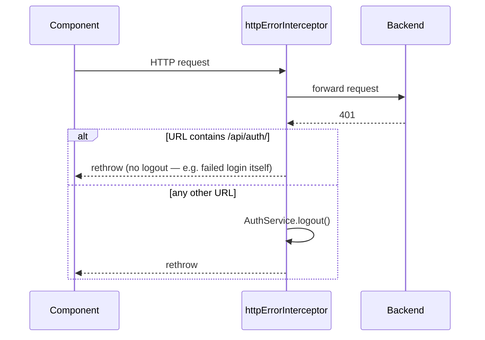

# Interceptors and guards

All three are the modern functional style (`HttpInterceptorFn`, `CanActivateFn`) — no class-based interceptors/guards in this app.

## `authInterceptor` (`core/interceptors/auth.interceptor.ts`)

Runs on **every** outgoing HTTP request. Reads the current token via `AuthService.getToken()` and, if present, attaches `Authorization: Bearer <token>`. Does not distinguish between the auth backend and the prospecting backend — the header is attached regardless of target host, which is harmless (the auth service simply ignores it on its public endpoints).

## `httpErrorInterceptor` (`core/interceptors/http-error.interceptor.ts`)

Also runs on every request. Catches `HttpErrorResponse`; if `status === 401` **and** the request URL does not contain `/api/auth/`, it calls `AuthService.logout()` before rethrowing the error. The `/api/auth/` exclusion prevents a failed login attempt itself from triggering a logout loop.

### Note on `428`

`httpErrorInterceptor` only special-cases `401`. The `428 Precondition Required` response (account has `password = NULL`, see the auth service's reclaim flow) is deliberately **not** handled here — it passes through untouched and is instead caught locally in `LoginComponent.submit()`'s error callback, because that component needs the `email`/`name` fields from the response body to redirect to `/register` with prefilled query params (see the root [`README.md`](../README.md#password-reset-redirect-http-428)).

## `authGuard` (`core/guards/auth.guard.ts`)

A `CanActivateFn` that allows navigation if `AuthService.isLoggedIn()` is `true`, otherwise redirects to `/login`. Protects `/projects`, `/projects/:id`, `/projects/:id/settings` (see [`routing.md`](routing.md)).

**Known limitation**: `isLoggedIn` only checks token *presence*, not expiry. An expired token still passes the guard; the first subsequent API call will 401 and `httpErrorInterceptor` will then log the user out. This means an expired session is only caught reactively, on the next request, not proactively at navigation time.
